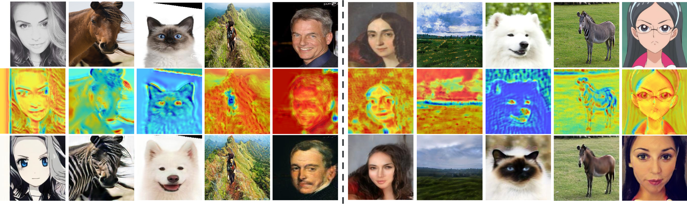

# U-GAT-IT

This is a forward of the [official implementation](https://github.com/taki0112/UGATIT) of the paper [**Unsupervised Generative Attentional Networks with Adaptive Layer-Instance Normalization for Image-to-Image Translation (ICLR 2020)**](https://arxiv.org/abs/1907.10830) which has a great result on unpaired image to image translation (selfie2anime, especially).

  

## Dataset
* [selfie2anime dataset](https://drive.google.com/file/d/1xOWj1UVgp6NKMT3HbPhBbtq2A4EDkghF/view?usp=sharing)

## Implementation
* [tensorflow](./tensorflow/)
* [pytorch](./pytorch/)

## Web page
* [Selfie2Anime](https://selfie2anime.com) by [Nathan Glover](https://github.com/t04glovern)
* [Selfie2Waifu](https://waifu.lofiu.com) by [creke](https://github.com/creke)

## Telegram Bot
* [Selfie2AnimeBot](https://t.me/selfie2animebot) by [Alex Spirin](https://github.com/sxela)

## Architecture

  

---

  

## Results
### Ablation study

  

### User study

  

### Kernel Inception Distance (KID)

  

## Author
[Junho Kim](http://bit.ly/jhkim_ai), Minjae Kim, Hyeonwoo Kang, Kwanghee Lee